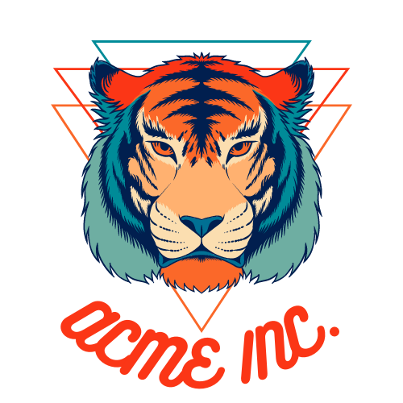
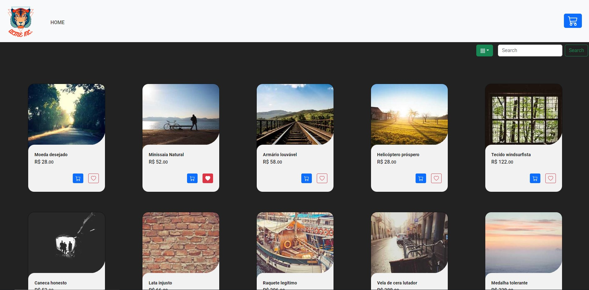

<!-- PROJECT LOGO -->
<br />
<p align="center">
  <a href="https://github.com/gustavofusco/acme-inc">
    
  </a>

  <h3 align="center">Acme Inc</h3>

  <p align="center">
    Um projeto para exemplo!
    <br />
    <a href="https://gustavofusco.github.io/acme-inc">Ver demo</a>
    ·
    <a href="https://github.com/gustavofusco/acme-inc/issues">Reportar Bug</a>
  </p>
</p>


<!-- TABLE OF CONTENTS -->
## Sumário

📌 [Sobre o projeto](#sobre-o-projeto)<br />
📌 [Tecnologias utilizadas](#tecnologias-utilizadas)<br />
📌 [Iniciando](#iniciando)<br />
📌 [Pré-requisitos](#pré-requisitos) <br />
📌 [Instalação](#instalação)<br />
📌 [Licença](#licença)<br />
📌 [Contato](#contato)<br />
📌 [Agradecimentos](#agradecimentos)<br />


<!-- ABOUT THE PROJECT -->
## Sobre o projeto
<p align="left">
  
  
</p>

### Tecnologias utilizadas
* [React](https://reactjs.org/)
* [Node](https://nodejs.org/en)
* [Axios](https://www.axios.com/)
* [Bootstrap](https://getbootstrap.com/)

<!-- GETTING STARTED -->
## Iniciando

Para iniciar o projeto localmente você precisará seguir algumas instruções.

### Pré-requisitos
* NodeJS
* Yarn ou Npm

### Instalação

```sh
# Clone o repositório
git clone https://github.com/gustavofusco/acme-inc.git

# Path ./back-end/
1. Instalar pacotes
# Yarn
yarn
# Npm
npm install

# Entrar na pasta do projeto web
cd acme-inc/

# Instale todos os pacotes
# Yarn
yarn
# Npm
npm install

# Ambiente de desenvolvimento

## Web
yarn start / npm start
```

<!-- LICENSE -->
## Licença
Distribuído sob a licença MIT. Veja `LICENSE` para mais informações.

<!-- CONTACT -->
## Contato

Gustavo Fusco Sperandio - gustavo.sperandio25@gmail.com

🔗 Link do projeto: [Acme Inc.](https://github.com/gustavofusco/acme-inc)
<br />
🔗 Link da demonstração: [Demo](https://gustavofusco.github.io/acme-inc)


<!-- ACKNOWLEDGEMENTS -->
## Agradecimentos
* [IMG Shields](https://shields.io)
* [Best README Template](https://github.com/othneildrew/Best-README-Template)

<!-- MARKDOWN LINKS & IMAGES -->
[license-url]: https://github.com/gustavofusco/acme-inc/blob/main/LICENSE.txt
[product-screenshot]: src/imgs/mainPage.jpg
[product-gif]: src/imgs/mobile.jpg
